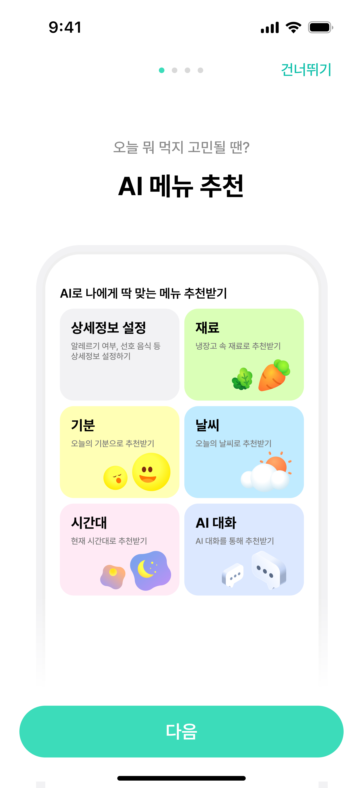
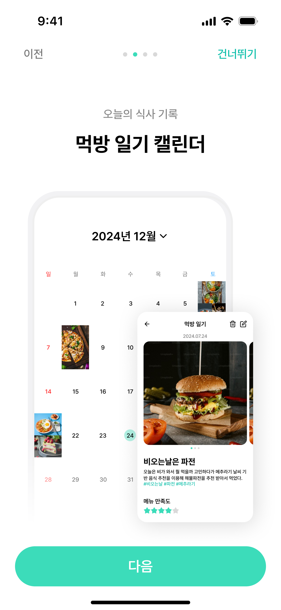
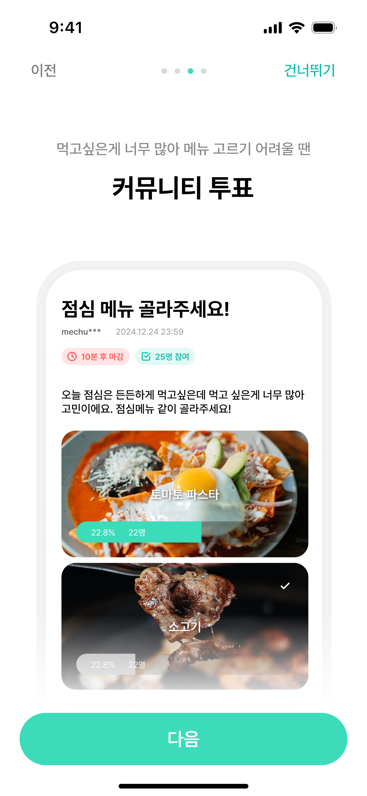
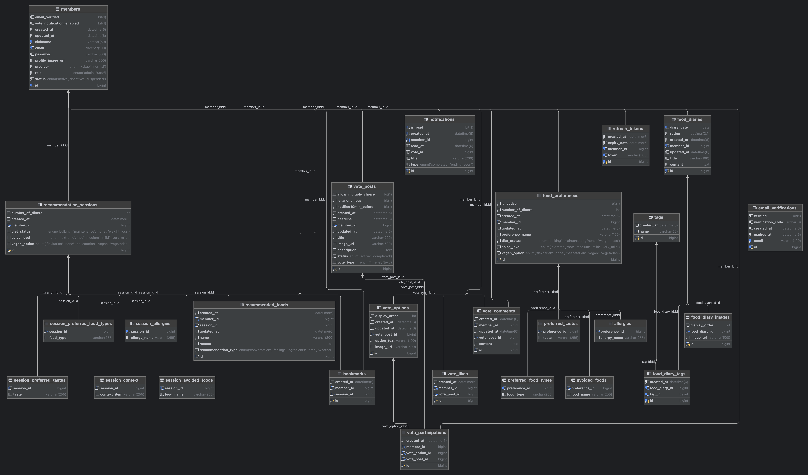

# 🐦 메추라기
AI 기반 메뉴/식당 추천 커뮤니티 플랫폼

---

## 📱 주요 화면

### 🎬 앱 데모

  

### 🎨 스플래시 & 온보딩
<table>
  <tr>
    <td align="center">
       
      <i>메추라기 시작 화면</i>
    </td>
    <td align="center">
       
      <i>AI 메뉴 추천</i>
    </td>
    <td align="center">
       
      <i>먹방 일기 캘린더</i>
    </td>
    <td align="center">
       
      <i>커뮤니티 투표</i>
    </td>
    <td align="center">
       
      <i>취향 설정</i>
    </td>
  </tr>
</table>

---

## 📌 프로젝트 소개

**Mechuragi**는 **Claude API**를 활용한 **AI 기반 메뉴 추천 커뮤니티 플랫폼**입니다.

**🎯 핵심 기능**
1. **메뉴 추천 (Claude API)**
   - 사용자 취향 정보 (식사인원, 알러지, 다이어트 여부, 비건, 매운맛 정도, 선호 음식 종류, 선호 맛, 안 먹는 음식 등)
   - 오늘의 상황 정보 (날씨, 시간대, 기분, 재료 등)
   - → **Claude API 분석**을 통한 맞춤 메뉴 추천

**추가 기능**: 실시간 인기메뉴, 투표 커뮤니티, 먹방 일기, 실시간 알림 (SSE)

---

## 🏗️ 시스템 아키텍처

  

**Infrastructure as Code (IaC) 기반 자동화 배포**
- **Terraform (HCL)**: AWS 인프라 프로비저닝 (VPC, EC2, S3, CloudFront, ACM 등)
- **Ansible**: 서버 구성 관리 및 Docker 컨테이너 배포
- **GitHub Actions**: CI/CD 파이프라인 자동화 (빌드, 테스트, Docker 이미지 푸시)
- **Docker Hub**: 컨테이너 이미지 레지스트리

**Multi-Server Architecture**
- **메인 서버 (EC2)**: Spring Boot 기반 API 서버, SSE 실시간 알림, Redis 캐싱, MySQL DB
- **AI 추천 서버 (EC2)**: 메뉴 추천 AI 서비스 (AWS Bedrock Claude API 연동)
- **Nginx 서버 (EC2)**: OpenResty + Lua 기반 JWT 인증 게이트웨이, 리버스 프록시, NAT 인스턴스, 블루-그린 배포

**Frontend & CDN**
- **S3**: React 프론트엔드 정적 파일 및 이미지 저장소
- **CloudFront**: 글로벌 CDN으로 낮은 지연시간 제공, HTTPS 지원 (ACM 인증서)

---

## 📊 ERD

  

---

## 🎯 AI 메뉴 추천 (Claude API)

### 📝 취향 설정

  

사용자의 식사 인원, 알레르기, 다이어트 여부, 비건 단계, 매운맛 선호도, 좋아하는 음식/싫어하는 음식 등 **상세한 취향 정보를 등록**합니다.

### 🎭 다양한 추천 방식

<table>
  <tr>
    <td align="center" width="33%">
       
      <b>기분 기반 추천</b> 
      <i>오늘의 기분에 맞는 메뉴</i>
    </td>
    <td align="center" width="33%">
       
      <b>날씨 기반 추천</b> 
      <i>실시간 날씨를 고려한 메뉴</i>
    </td>
    <td align="center" width="33%">
       
      <b>AI 대화 추천</b> 
      <i>자연어로 상황을 설명하면 Claude가 분석</i>
    </td>
  </tr>
</table>

**Claude API**가 사용자의 취향 정보와 실시간 상황(기분, 날씨, 시간대, 재료)을 종합 분석하여 **개인 맞춤형 메뉴**를 추천합니다.

---

## 🎯 제작 목표

🍽 Claude API 기반 맞춤 메뉴 추천
📅 먹방 일기 캘린더로 식사 기록
👥 커뮤니티 투표로 메뉴 선택
🔔 실시간 알림 및 인기메뉴 확인

---

## ✅ 기대 효과

- Claude API를 활용한 정확하고 맥락 있는 메뉴 추천
- 메뉴 결정 스트레스 해소 및 식사 경험 향상
- 실시간 인기메뉴와 커뮤니티 기반 소통 경험 강화

---

## ⚙️ 주요 기능

### 🎯 핵심 추천 시스템

| 구분 | 기능 설명 |
|------|-----------|
| **메뉴 추천** | Claude API 기반 맞춤 메뉴 추천 - 사용자 취향 (식사인원, 알러지, 다이어트, 비건, 매운맛 정도, 선호 음식, 선호 맛, 안 먹는 음식) - 상황 정보 (기분, 날씨, 재료, 시간대) |

### 📱 부가 기능

| 구분 | 기능 설명 |
|------|-----------|
| 실시간 인기메뉴 | 현재 가장 인기 있는 메뉴 실시간 확인 |
| 투표 커뮤니티 | "오늘 뭐 먹지?" 주제로 투표 생성 및 참여 |
| 먹방 일기 | 캘린더 기반의 식사 기록 및 사진 저장 |
| 실시간 알림 | 투표 결과, 추천 알림 등 실시간 알림 (SSE) |
| 사용자 기능 | 로그인 / 회원가입 / 설정 |

---

## 💻 기술 스택

### 🎨 Frontend

### 🛠 Backend

### 🗄 Database & Cache

### ☁️ Infra

### 🔄 CI/CD

### 📊 Logging

### ⚖️ Load Balancing & Testing

**이미지 업로드: Legacy vs Pre-signed URL**

| 엔드포인트 | Legacy (avg) | Pre-signed URL (avg) | 개선율 |
|------------|:------------:|:--------------------:|:------:|
| 프로필 이미지 | ~339ms | 122ms | **↓ 약 64%** |
| 다이어리 이미지 | ~117ms | 71ms | **↓ 약 39%** |
| 투표 이미지 (2장) | ~184ms | 160ms | **↓ 약 13%** |

서버가 이미지 바이트를 직접 처리하지 않아 고부하 시 서버 부담 감소 → Pre-signed URL 방식 채택

**AI 추천 경로: Direct vs Legacy**

| 경로 | 흐름 |
|------|------|
| **Direct** | Client → Nginx (Lua JWT 검증) → AI Server → Bedrock |
| **Legacy** | Client → Nginx → Main Server (Spring Security JWT 검증) → AI Server → Bedrock |

**테스트 환경**

| 항목 | 설정값 |
|------|--------|
| 도구 | k6 |
| 가상 사용자 (VU) | 50명 동시 요청 |
| 테스트 시간 | 60초 |
| Mock 지연 | 3,000ms (Bedrock) + 200ms (VPC 네트워크) = 3,200ms |
| Tomcat 스레드 제한 | Main Server 32개, AI Server 32개 |

> Bedrock 호출을 Mock으로 대체하여 외부 변수를 제거하고 인프라 구조 자체의 성능만 측정

**측정 결과**

| 지표 | Direct Path | Legacy Path | 차이 |
|------|:-----------:|:-----------:|:----:|
| avg | 3,231ms | 5,033ms | **+56%** |
| p95 | 3,545ms | 6,470ms | **+82%** |
| max | 3,556ms | 10,321ms | **+190%** |
| 처리량 (60s) | 285건 | 195건 | **-32%** |
| 에러율 | 0% | 0% | - |

**분석**

Legacy Path는 Main Server에서 1차 큐잉, AI Server에서 2차 큐잉이 직렬로 발생하는 구조적 문제가 확인되었습니다. Main Server가 RestClient(동기 블로킹)로 AI Server를 호출하는 구조상, Main Server 스레드는 AI Server 응답이 올 때까지 점유되어 부하 증가 시 두 서버의 스레드 풀이 동시에 소진됩니다.

Direct Path는 스레드 소비 지점이 1개로, 응답 시간이 Mock 지연(3,200ms)에 수렴하며 편차가 거의 없었습니다. Lua 인증 오버헤드(~1~5ms)는 구조적 병목과 비교해 무시 가능한 수준으로, **처리량 32% 향상, p95 응답시간 45% 단축** 효과를 확인하여 Direct Path를 채택하였습니다.

### 🔗 Version Control

### 🎨 Design

---

## 🤝 협업

### 📋 회의록 정리

> 📎 [Notion 프로젝트 페이지 바로가기](노션 링크 삽입)

### 💬 소통

### 📎 협업 문서

| 문서 | 링크 |
|------|------|
| 📄 API 설계도 | [바로가기](./docs/API설계도.pdf) |
| 📊 WBS | [바로가기](./docs/WBS.pdf) |

---

## 👥 팀원 소개

| 이름 | 역할 | 담당 기능                                                                                                                                                                                                                                                                                                                                                                                                                                                                                                                                                                                                                                                                                        |
|------|------|----------------------------------------------------------------------------------------------------------------------------------------------------------------------------------------------------------------------------------------------------------------------------------------------------------------------------------------------------------------------------------------------------------------------------------------------------------------------------------------------------------------------------------------------------------------------------------------------------------------------------------------------------------------------------------------------|
| 🎨 박은진 | Design | - 서비스 전체 UI/UX 디자인 및 시각적 요소 기획 (Figma)                                                                                                                                                                                                                                                                                                                                                                                                                                                                                                                                                                                                                                                       |
| 🐰 김지영 | Frontend | - 프론트엔드 프로젝트 초기 설정 및 아키텍처 구성   - 전체 페이지 구현 (온보딩 · 홈 · 로그인 · 회원가입 · 마이페이지 · 설정 · 캘린더 · 커뮤니티 · 메뉴 추천 전 유형)   - Header · Footer · Toast · NotificationBell 공통 컴포넌트 구현   - Framer Motion 기반 페이지 전환 애니메이션 및 인터랙션 구현   - 홈 화면 TMI 슬라이드 배너 기획 및 구현 (10종)   - 로딩 스피너 · 에러 상태 등 사용자 피드백 UI 처리                                                                                                                                                                                                                                                                                                                                                                                          |
| 🦝 김진아 | Backend | - JWT 인증 (Access/Refresh Token 발급·갱신) · 카카오 OAuth2 소셜 로그인 · Spring Security 설정   - 회원 도메인 구현 (회원가입 · 프로필 수정 · 비밀번호 변경 · 소프트 탈퇴 · 알림 설정)   - 이메일 인증 (AWS SES) · 비밀번호 찾기 · 환영 메일 발송   - 음식 취향 설정 CRUD ([상세보기](./docs/trouble-shooting/preference-refactoring.md))   - AI 추천 결과 저장/조회 · 북마크 기능   - SSE 실시간 알림 (투표 마감 임박·종료) · Redis 기반 인기 메뉴 스케줄러   - AWS 인프라 구축 (Terraform: VPC · EC2 · S3 · CloudFront · ACM · SES · IAM)   - Ansible 서버 구성 자동화 · Nginx 라우팅 · CloudWatch 로그 설정   - 프론트엔드 일부 API 연동 (AI 추천 · 취향 설정 · 북마크 · 알림 · 비밀번호 찾기 · 인기 메뉴)   - k6 부하 테스트 (AI 추천 경로 성능 비교)   - AI 추천 서비스 전면 리팩토링   - OpenResty + Lua JWT 인증 게이트웨이 전체 재구현 ([*관련문서 바로가기*](./docs/trouble-shooting/nginx-gateway-refactoring.md)) |
| 🐿️ 김희주 | Backend | - DB 설계 및 JPA 엔티티 모델링   - 커뮤니티 투표 시스템 구현 (CRUD · Redis 기반 핫한 투표 순위 · 좋아요 · 댓글)   - 먹방 일기 구현   - AWS Bedrock Claude API 연동 및 AI 메뉴 추천 서비스 구현   - OpenResty + Lua JWT 인증 게이트웨이 구현   - GitHub Actions + Docker 기반 Blue-Green 무중단 배포 구축   - 프론트엔드 일부 API 연동 (먹방 일기 · 투표 · 온보딩 · 이미지 업로드)   - k6 부하 테스트 (이미지 업로드 방식 성능 검증)                                                                                                                                                                                                                                                                                                                                                            |
