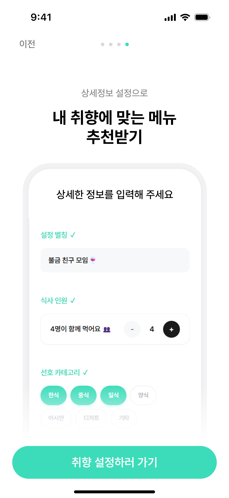

# 🐦 메추라기
AI 기반 메뉴/식당 추천 커뮤니티 플랫폼

---

## 📱 주요 화면

### 🎨 스플래시 & 온보딩
<table>
  <tr>
    <td align="center">
       
      <i>"AI가 만드는 모두의 식탁" - 메추라기 시작 화면</i>
    </td>
    <td align="center">
       
      <i>온보딩 화면</i>
    </td>
  </tr>
</table>

---

## 📌 프로젝트 소개

**Mechuragi**는 **Claude API**와 **Custom ML 모델**을 활용한 **AI 기반 메뉴/식당 추천 커뮤니티 플랫폼**입니다.

**🎯 핵심 기능**
1. **메뉴 추천 (Claude API)**
   - 사용자 취향 정보 (식사인원, 알러지, 다이어트 여부, 비건, 매운맛 정도, 선호 음식 종류, 선호 맛, 안 먹는 음식 등)
   - 오늘의 상황 정보 (날씨, 시간대, 기분, 재료 등)
   - → **Claude API 분석**을 통한 맞춤 메뉴 추천

2. **식당 추천 (Custom ML Model)**
   - 추천받은 메뉴 정보
   - 사용자 위치 정보
   - 식당 요구사항 (주차 가능 여부, 유아 동반 가능, 펫프렌들리, 비건, 할랄식당)
   - → **Custom ML 모델 분석**을 통한 최적 식당 추천

**추가 기능**: 실시간 인기메뉴, 투표 커뮤니티, 먹방 일기, 실시간 알림

---

## 🏗️ 시스템 아키텍처

  

**Infrastructure as Code (IaC) 기반 자동화 배포**
- **Terraform**: AWS 인프라 프로비저닝 (VPC, EC2, S3, CloudFront, ACM 등)
- **Ansible**: 서버 구성 관리 및 Docker 컨테이너 배포
- **GitHub Actions**: CI/CD 파이프라인 자동화 (빌드, 테스트, Docker 이미지 푸시)
- **Docker Hub**: 컨테이너 이미지 레지스트리

**Multi-Server Architecture**
- **메인 서버 (EC2)**: Spring Boot 기반 API 서버, STOMP 웹소켓, Redis 캐싱, MySQL DB
- **AI 후보 서버 (EC2)**: 메뉴 추천 AI 서비스 (Claude API 연동)
- **AI 장소 서버 (EC2)**: FastAPI 기반 식당 추천 ML 모델 (Sentence-BERT)
- **Nginx (EC2)**: 리버스 프록시 및 로드 밸런싱

**Frontend & CDN**
- **S3**: React 프론트엔드 정적 파일 및 이미지 저장소
- **CloudFront**: 글로벌 CDN으로 낮은 지연시간 제공, HTTPS 지원 (ACM 인증서)

---

## 🎯 1단계: AI 메뉴 추천 (Claude API)

### 📝 취향 설정

  

사용자의 식사 인원, 알레르기, 다이어트 여부, 비건 단계, 매운맛 선호도, 좋아하는 음식/싫어하는 음식 등 **상세한 취향 정보를 등록**합니다.

### 🎭 다양한 추천 방식

<table>
  <tr>
    <td align="center" width="33%">
       
      <b>기분 기반 추천</b> 
      <i>오늘의 기분에 맞는 메뉴</i>
    </td>
    <td align="center" width="33%">
       
      <b>날씨 기반 추천</b> 
      <i>실시간 날씨를 고려한 메뉴</i>
    </td>
    <td align="center" width="33%">
       
      <b>AI 대화 추천</b> 
      <i>자연어로 상황을 설명하면 Claude가 분석</i>
    </td>
  </tr>
</table>

**Claude API**가 사용자의 취향 정보와 실시간 상황(기분, 날씨, 시간대, 재료)을 종합 분석하여 **개인 맞춤형 메뉴**를 추천합니다.

---

## 🏪 2단계: 맞춤 식당 추천 (Custom ML Model)

### 🗺️ 배리어프리 식당 필터링
<table>
  <tr>
    <td align="center" width="50%">
       
      <b>식당 요구사항 설정</b>
    </td>
    <td align="center" width="50%">
       
      <b>AI 메뉴/장소 추천</b>
    </td>
  </tr>
</table>

**포용적 식문화를 위한 배리어프리 필터:**
- 🚗 **주차 가능** - 차량 이용자를 위한 주차 공간
- 🐾 **펫 프렌들리** - 반려동물 동반 가능
- ♿ **휠체어 접근** - 경사로, 승강기 등 이동약자 지원
- 👶 **유아 동반** - 유아 의자, 수유실 등 키즈 케어 시설
- 🥗 **비건/할랄** - 종교 및 채식 단계별 엄격한 식단 기준

**Sentence-BERT 기반 Custom ML 모델**이 사용자 위치, 취향, 배리어프리 조건을 종합하여 **최적의 식당**을 추천합니다. 특히 **30년 이상 전통 노포**에는 가중치를 부여하여 검증된 맛집을 우선 추천합니다.

---

## 🎯 제작 목표

🍽 Claude API 기반 맞춤 메뉴 추천
🏪 Custom ML 모델 기반 식당 추천
📅 먹방 일기 캘린더로 식사 기록
👥 커뮤니티 투표로 메뉴 선택
🔔 실시간 알림 및 인기메뉴 확인

---

## ✅ 기대 효과

- Claude API를 활용한 정확하고 맥락 있는 메뉴 추천
- Custom ML 모델을 통한 사용자 맞춤 식당 추천
- 상세한 식당 요구사항 반영 (주차, 유아동반, 펫프렌들리, 비건, 할랄)
- 메뉴 결정 스트레스 해소 및 식사 경험 향상
- 실시간 인기메뉴와 커뮤니티 기반 소통 경험 강화

---

## ⚙️ 주요 기능

### 🎯 핵심 추천 시스템

| 구분       | 기능 설명 |
|------------|-----------|
| **메뉴 추천** | Claude API 기반 맞춤 메뉴 추천 - 사용자 취향 (식사인원, 알러지, 다이어트, 비건, 매운맛 정도, 선호 음식, 선호 맛, 안 먹는 음식) - 상황 정보 (기분, 날씨, 재료, 시간대) |
| **식당 추천** | Custom ML 모델 기반 식당 추천 - 메뉴 정보 + 위치 정보 - 식당 요구사항 (주차 가능, 유아동반 가능, 펫프렌들리, 비건, 할랄식당) |

### 📱 부가 기능

| 구분       | 기능 설명 |
|------------|-----------|
| 실시간 인기메뉴 | 현재 가장 인기 있는 메뉴 실시간 확인 |
| 투표 커뮤니티 | "오늘 뭐 먹지?" 주제로 투표 생성 및 참여 |
| 먹방 일기 | 캘린더 기반의 식사 기록 및 사진 저장 |
| 실시간 알림 | 투표 결과, 추천 알림 등 실시간 푸시 알림 |
| 사용자 기능 | 로그인 / 회원가입 / 설정 |

---

## 💻 기술 스택

### 🎨 Frontend

### 🛠 Backend

### 🗄 Database & Infra

### 🔄 CI/CD

---

## 🔗 Version Control & Collaboration

> 📎 [Notion 프로젝트 페이지 바로가기](우리 노션 링크 넣기)

---

## 👥 팀원 소개

| 이름      | 역할       | 담당 기능                                                                                                                                                |
|---------|----------|------------------------------------------------------------------------------------------------------------------------------------------------------|
| 🎨 박은진  | Design   | - 사용자 인터페이스(UI) 디자인 및 시각적 요소 기획                                                                                                                      |                                                                                                                |
| 🐰 김지영  | Frontend | - 메인 화면   - AI 추천   - 취향 설정   - 온보딩 설계                                                                                                      |
| 🦝 김진아  | Backend  | - AWS EC2 인프라 구축 (Terraform, Ansible)   - 실시간 알림 및 인기 메뉴   - 기분, 재료 기반 메뉴 추천 로직 구현   - OAuth2, JWT 회원/인증                                    |
| 🐿️ 김희주 | Backend  | - 데이터베이스 설계 및 JPA 엔티티 기반 모델링   - Docker 기반 배포 및 컨테이너화   - 먹방 일기 및 커뮤니티 투표 게시판 (핫한 투표) 구현   - AWS Bedrock 기반 Claude API 연동 (날씨, 시간대, 대화형 추천) |

